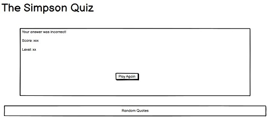
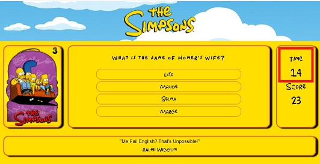

# The Simpsons Quiz

The Simpsons is a word wide famous animated sticom which is set in a fictional town called Springfield. The Simpsons family consists in the parents, Homer and Marge, 
and their three children, Bart, Maggie and Lisa. The main goal of this show is make parodies of American culture and society wihtou excluding even humand condition. 
This quiz was built to test any fan's general knowledge about the show through 20 questions divided between these different categories:

- Level 1 - General Basic Questions
- Level 2 - Family character's Names
- Level 3 - Questions about Homer
- Level 4 - Questions about Lisa
- Level 5 - Questions about Bart
- Level 6 - Questions about Marge
- Level 7 - Questions about Maggie 
- Level 8 - Questions about Bart's friends
- Level 9 - Questions about Flanders
- Level 10 - Questions about Homer's friends/bar 
- Level 11 - Questions about Krusty
- Level 12 - Questions about Comic Store Guy
- Level 13 - Questions about Ralph 
- Level 14 - Questions about Aliens
- Level 15 - Questions about Otto
- Level 16 - Questions about other characters
- Level 17 - Questions about the shows generic
- Level 18 - Questions about Simpsons The Movie
- Level 19 - Guess the author of these famous quotes
- Level 20 - Final question about the year when The Simpsons was first broadcasted

The game rules are very simple: the user has 15 seconds to answer correctly each level's question, if the user answers incorrectly the game ends but 
if the answer given is correct, the remaining seconds will be added as points to the score and he will progress to the next level.

This quiz's goal is to:
* Test the fan's general knowledge.
* Teach more fun facts about the show.
* Show famous quotes from the show and their authors.

A live demo of website can be found [here](https://claudio-c-santos.github.io/MS2-The_Simpsons-Quizz/).

## UX

The main users of this website will be The Simpsons fans that want to test out their knowledge on the show. Each level's category gives the user opportunity 
to not only test general facts about the show but also specific facts of some characters and places within the show.

The navigation is very simple since, once the aplication runs, the only interaction available is the "Ay Caramba!" button which starts the game. When in the actual quiz,
the user can only select one answer from the ones available, sometimes there are four option but in the "Yes/No" kind of questions there, obviously, only two options.

### User Stories

- As a fan of the show, I want to play the quiz, in order to test my knowledge on the show.
- As a fan of the show, I want to know who's the author of each random quote displayed, to increase my knowledge on the show.
- As a new player, I want to know the game rules, to know how to play the game.
- As a player, I want to know if my answer is correct or not, to confirm my answer.
- As a player, I want to know how much time I have left to answer the current question, in order to manage my time.
- As a player, I want to know what's is my current score, to see if I should tmake an effort to answer faster.
- As a player, I want to know what's my current level, to see if I'm close to completing the quiz.
- As a player that answered incorrectly, I want to know what was my score and which level did I reach, to evaluate my performance.
- As a player that completed the quiz, I want to know what was my score in the end, to evaluate my performance.

### Strategy

The goal of this quiz is to give an oportunity the The Simpsons fans to test their general knowledge about the show. An effort was made so that all the graphic
elements are exactly the same as the ones used on the show. All the images, colors and some of the fonts used are faithful to the original. 
The colors were gathered using an eye drop tool in order to select, for example, the exact type of yellow used in the actual show. All the images were also 
verified to be exactly like the show and that there was no flaw or differences.
 
The questions are divided between 20 categories as intructed in the beginning of this file. This gives the user an oportunity to test various areas of knowledge on The Simpsons.

### Scope

The whole quiz was built thinking that the user will be a true The Simpsons fan and will have a more enjoyable experience if everything looks exactly like the show.

### Wireframes

* Home

* Questions

* When wrong answer is given

* When all 20 questions are answered correctly

### Surface

The palette of colors was chosen based on the show itself.

## Features

When the index is loaded a set of instructions is displayed along with a button to start the quiz. Below there's also a box displaying a random quote from one of the characters.
Everytime the user clicks on something the quote changes. Once the button "Ay Caramba!" is pressed the quiz will start.
 
On the left, there's a box with and image and a number, this number represents the current level. 
It will change the image and increase the number as the user progresses in the quiz. The middle box is where the current level's question and answer options are displayed.
On the right, there's another box displaying the remaining time to answer the current question along with the current score. The score is calculated by summing the remaining 
seconds when each level's question is answered correctly.

### Existing Features

<ins>Feature 1</ins> 
* Allows a fan to test he/she's knowledge on the show by playing the quiz. 

<ins>Feature 2</ins>
* Allows the user that has the interest, to know who is the every random quote displayed. 

<ins>Feature 3</ins> 
* A new player can learn the rules on the index page. 

<ins>Feature 4</ins> 
* The player will know if the answer selected is correct because the div will turn green if correct and red if incorrect. 

 

<ins>Feature 5</ins> 
* A timer is displayed on the right side of the screen to allow the player to manage his time left. 

<ins>Feature 6</ins> 
* On the right side of the screen, below the timer, the current score is displayed for the player to keep track. 

<ins>Feature 7</ins> 
* On the left side of the screen, an image is displayed which shows the current level on its top right corner. 

<ins>Feature 8</ins> 
* When a question is answered incorrectly the game ends and the final score along with the level reached are displayed for the player's knowledge. 

<ins>Feature 10</ins> 
* When the player completes the quiz, his final score is displayed along with a congratulations message so that he know the quiz has been completed. 

### Features Left to Implement

Some sound effects when the user starts the quiz, when answers incorrectly or when answers all 20 questions correctly.

# Technologies Used

- This website uses HTML, CSS and JavaScript programming languages.
- [jQuery v3.5.1](https://code.jquery.com/)
    - Used to simplify DOM manipulation.
- [Google Fonts](https://fonts.google.com/)
    - Josefin Sans font style was used with 500 has font weight.

# Testing

All the tests done to this website can be found in [testing.md](testing.md).

# Deployment

This project was developed using Gitpod IDE, committed to git and pushed to GitHub using the built in function within Gitpod.

To deploy this page to GitHub Pages from its GitHub repository, the following steps were taken:
1. Log into [GitHub](https://github.com/).
2. Navigate to my repositories and select **Claudio-C-Santos/MS2-The_Simpsons-Quizz**.
3. From the menu items below the repository name, select **Settings**.
4. Scroll down to the **GitHub Pages** section.
5. Under **Source** be sure **Master Branch** is selected. 
6. On selecting Master Branch the page is automatically refreshed, the website is now deployed.

### Procedure to run code locally

1. Log into [GitHub](https://github.com/).
2. Navigate to my repositories and select **Claudio-C-Santos/MS2-The_Simpsons-Quizz**.
3. Under the repository name, click "Clone or download".
4. Click on dropdown button Code above the repository files area.
5. In your local IDE open Git Bash.
6. Access the directory you wish to clone the respository into.
7. Type git clone and then paste the URL you copied in Step 3 like this "git clone https://github.com/Claudio-C-Santos/MS2-The_Simpsons-Quizz/settings"
9. Press Enter. Your local clone will be created.

## Credits

### Content

- This proejct was built based on another project found on GitHub from gabepettus https://github.com/gabepettus/TimedQuiz.
- All the images were sourced from a fanart website https://fanart.tv/series/71663/the-simpsons/.
- The below websites were used to source the list of quotes to display randomly.
    - https://screenrant.com/best-quotes-from-the-simpsons/
    - https://www.goldderby.com/gallery/the-simpsons-funniest-homer-simpson-quotes/
    - https://www.scarymommy.com/simpsons-quotes/
- The questions and respective answers were all written by me using Wikipedia to confirm or get additional information.

### Acknowledgements

Since this quizz is based on the one built by [gabepettus] (https://github.com/gabepettus), I would like to congratulate and thank for his work. 
It was very helpful for me because it allowed me to understand his structure so that I could build one that fitted my needs and ideas. 
Another person that I would like to thank a lot is my mentor, Gurjot Singh, who guided me when I was a bit lost after completing Javascript's module. 
He advised me and gave me support in order to overcome my issues and be ready to properly build my MS2. Student Care and the Slack community also provided a lot of support. 
I would like to thank The Simpsons fanart community for creating amazing and proper images and other graphic elements. 
For last, I would like to thank my girlfriend, Dennelise Wever, which has been giving all the support to complete this course. Including all my friends that spent some time testing and giving feedback on this project.  